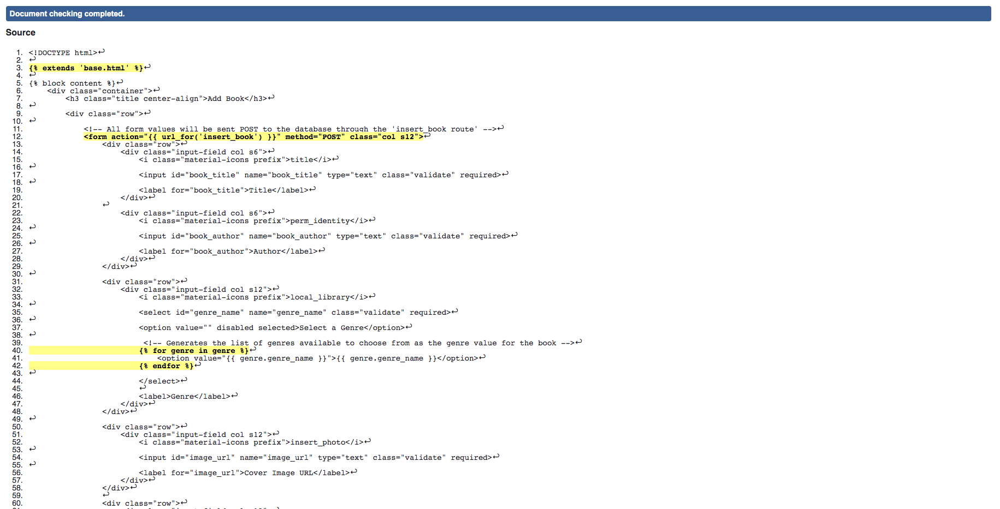
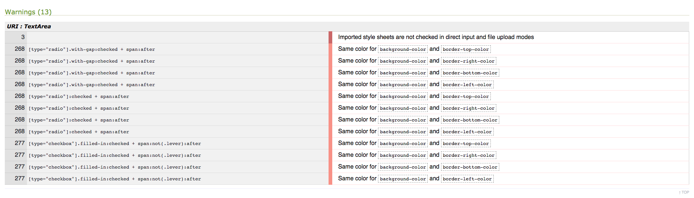

# Pen Hub

## Milestone Project 3 - Data Centric Development

For this project I have decided to build a book review and recommendation site.

The site will alow users to add, edit or delete details of a particular book and their review of it.
The user will also be able to search for books based on a rating system and to also purchase the book through
an affiliate link. The site owner will then be able to earn money based on each book purchased through the link.

***

## Contents

1. [UX](https://github.com/vdgvzr/milestone-project-3#ux)
    - [Goals](https://github.com/vdgvzr/milestone-project-3#goals)
    - [Developer Goals](https://github.com/vdgvzr/milestone-project-3#developer-goals)
    - [User Stories](https://github.com/vdgvzr/milestone-project-3#user-stories)
    - [Design](https://github.com/vdgvzr/milestone-project-3#design)
        - [Frameworks](https://github.com/vdgvzr/milestone-project-3#frameworks)
        - [Colours Used](https://github.com/vdgvzr/milestone-project-3#colours-used)
        - [Fonts](https://github.com/vdgvzr/milestone-project-3#fonts)
        - [Icons](https://github.com/vdgvzr/milestone-project-3#icons)
        - [Wireframes](https://github.com/vdgvzr/milestone-project-3#wireframes)
2. [Features](https://github.com/vdgvzr/milestone-project-3#features)
    - [Existing Features](https://github.com/vdgvzr/milestone-project-3#existing-features)
    - [Features Left to Implement](https://github.com/vdgvzr/milestone-project-3#features-left-to-implement)
3. [Testing](https://github.com/vdgvzr/milestone-project-3#testing)
4. [Validation](https://github.com/vdgvzr/milestone-project-3#validation)
    - [HTML](https://github.com/vdgvzr/milestone-project-3#html)
    - [CSS](https://github.com/vdgvzr/milestone-project-3#css)
    - [JavaScript](https://github.com/vdgvzr/milestone-project-3#javascript)
    - [Python](https://github.com/vdgvzr/milestone-project-3#python)
    - [Compatibility](https://github.com/vdgvzr/milestone-project-3#compatibility)
5. [Deployment](https://github.com/vdgvzr/milestone-project-3#deployment)
    - [Deploying The Site](https://github.com/vdgvzr/milestone-project-3#deploying-the-site)
    - [Deploying Locally](https://github.com/vdgvzr/milestone-project-3#deploying-locally)
6. [Technologies Used](https://github.com/vdgvzr/milestone-project-3#technologies-used)
7. [Credits](https://github.com/vdgvzr/milestone-project-3#credits)
    - [Content](https://github.com/vdgvzr/milestone-project-3#content)
    - [Media](https://github.com/vdgvzr/milestone-project-3#media)
    - [Code](https://github.com/vdgvzr/milestone-project-3#code)
    - [Acknowledements](https://github.com/vdgvzr/milestone-project-3#acknowledgements)

***

## UX

### Goals

As part of the Full Stack Developer course from [Code Institute](https://codeinstitute.net/), this project was designed to fulfill the scope of creating an application
that utilises CRUD operations on a database.

The primary demographic for the site will of course be book lovers, however there will likely be a very wide and diverse range
of people that would have interest in it. For this reason, I will aim to design the site to be as simple to use as possible,
leaving room for the appropriate information to be displayed as cleanly and easy to read as possible.

* Originally the idea was to create the book entry and review simultaneously, however I have decided to keep the book details
and review entries separate to mitigate duplication of book entries. Ideally the, review and rating for the book will appear beneath
the book details so two separate forms will have to be present on the site - one for book entry, and one for review entry for said book.

### Developer Goals

* Create an easy to use webapp where I can learn about and perform CRUD operations on a mongo database.
* Practice how to use Heroku, Mongo DB, Jinja, Materialize and Flask.

### User Stories

As a user, I would like to:

- [x] Search for and browse for my favourite book or something to read next.
- [x] Search for books based on genre.
- [x] See what other people are saying about books.
- [x] If the book doesn't exist on the site, I can add a book.
- [x] Be able to leave my own reviews on other books that other users have added.
- [x] Be able to buy a book via a link to an online shop.

***

### Design

I used the materialize framework to design the site. As much consideration as possible has gone into implementing components and altering the styles of each.
The books to be displayed to the user as easy-to-navigate interactive cards that contain essential information about the book, as well as a book rating on display.

The colour scheme and logo design was influenced by the name 'Pen Hub' being a play on words, being that pens are associated with writing books, and the site will
act as a 'hub' for said books. As books and book readers differ hugely across all demographics, it was important to maintain a smart, yet casual overall design.

#### Frameworks

* [Materialize 1.0.0](https://materializecss.com/)
    - I chose to use Materialize for the design framework as opposed to bootstrap because I prefer how simple it is to implement and modify, leaving more space for me
    to spend more time developing the logic and functionality of the site.

* [JQuery 3.5.1](https://jquery.com/)
    - To minimise the use of JavaScript in my project and to concentrate more on Python, I have used JQuery as a foundation to build my scripts upon.

* [Flask 1.1.2](https://flask.palletsprojects.com/en/1.1.x/)
    - Flask has been used as a framwork for this project in order to render the back end with the front.

#### Colours Used

I chose the colors based on the initial design of using yellow and black with grey to highlight the important sections, such as the book cards.
The primary color used is goldenrod, chosen because of it's lack of intensity compared to gold/yellow. Various shades of materialize grey is used for the standout sections.

Colours:

-  `#000000 - black, base colour`
-  `#DAA520 - goldenrod, primary colour`
-  `#A9A9A9 - darkgray, secondary colour`
-  `#808080 - gray, secondary colour`
-  `#D3D3D3 - lightgray, secondary colour`

Materialize Colors:

-  `#212121 - grey darken-4`
-  `#424242 - grey darken-3`
-  `#008000 - red (form valid)`
-  `#FF0000 - red (form invalid)`

#### Fonts

The font pair I chose for the site was Roboto and Noto Sans JP from [Google Fonts](https://fonts.google.com) because it closesly matches the smart-casual aesthetic of the site.

#### Icons

[Materialize Icons](https://material.io/) Have been used exclusively for the site, as they are designed to work with the Materialize css framework.

#### Wireframes

The initial wireframing design was created using [Balsamiq](https://balsamiq.cloud/).

High quality mockups of the site can be found [here](static/assets/mockups/mockups.png "Mockups").

The implementation has stayed fairly consistent to the original design.

***

## Features

### Existing Features

#### Search Books by Title or Author

* The user can search by title or author to find books.

#### Registration and Login Functionality

* If a user wishes to add books and reviews themselves, then they can register and login to do so.

#### Add, Edit and Delete Book Entries and Reviews

* Once logged in, the user will be able to perform CRUD operations for books and reviews.

#### Buy Books

* Upon accessing the book review page, registered and unregistered users will be able to buy a book through a custom link.

### Features Left to Implement

* I would like the user profile to be expanded to include an option to upload a profile picture.
* I would also like to include a report or email feedback page, in case there are users leaving inappropriate reviews or book entries.
* The ability to register as an admin. As the site grows, there will no doubt be a need for the moderation of other users and content.

***

## Testing

### Creating an Account

I created a test account in order to use the full functionality of the site. Once created, I tested the login by deliberately providing
username and password errors to test how error messaging and rerouting works. I also tried to register with the same account name, thus providing the
correct course for a user to be redirected to the login page. In future, I would like to implement a password recovery option if the user has
forgotten their password.

### Add, Edit, Delete a Book

Whilst building the site, I have created multiple book entries, the information for which has been sourced online. In theory, there can be no end to
how many books are added, and users are encouraged to add books as often as possible, for example, if the search function returns no results.

For some book entries, I have deliberately made spelling errors so that I am able to edit that entry and replace. If there is a book that shouldn't be there,
I have the ability as a user to delete the entry entirely, not before being prompted by a modal to avoid user error by accidentally clicking on the delete button.

After successfully building the book database, I was able to go through each relevent book display page and access the same review page through each.

### Add, Edit, Delete a Review

As with the book CRUD, the review Crud follows the same principles. If the user is logged in, they are able to view the review form placed at the top of the review list.
That review will appear as the last in the list. In future, I would like for the user to have the ability to 'upvote' other user's reviews, in order to create a sorting
system of the reviews based on the highest amount of 'votes'.

As a user, if I am not satisfied with the review, I am able to edit or delete my own review of the book and nobody elses. Thus ensuring that other users views do not get
deleted maliciously. If an admin account is implemented, they would be able to moderate the reviews of the books as well as the book information itself.

### Responsiveness

Thankfully, Materialize provides an easy-to-implement grid system in order to arrange the responsiveness of the site. I have taken full advantage of this
and have added the appropriate styles to the elements in a way in which media queries within my own [stlye.css](static/assets/styles/style.css) file are not needed.

To test responsiveness, I have used Google's dev tools to inspect the site between various screen sizes.

### Other Bugs and Problems

*  A 5 star rating system was to be implemented for the user to rate a book. After trying to implement using css, it became known that it is very difficult to do with materialize as the form framework.
* Another known bug is to do with the Flask pagination. I have implemented the pagination as is, however it will only display in the pagination.info tag as showing 10 results always. This is something
I would like to have rectified in the future. See: [Flask Pagination](https://github.com/lixxu/flask-paginate).

***

## Validation

### HTML

* [HTMLValidator](https://validator.w3.org/)
    - The only errors that appeared present as a result of validating the HTML were the Jinja templating syntax, as demonstrated below. Everything else was validating properly.
    Note - all code beautification was performed manually.

### CSS

* [CSSValidator](https://jigsaw.w3.org/css-validator/)
    - The only warnings present in the style.css file that of my overriding of the Materialize colour scheme for certain elements. As this is the easiest way to override the Materialize CSS
    without installing Sass, I have not changed the styling here. The rest of the file is valid.

### JavaScript

* [JavaScriptValidator](https://esprima.org/demo/validate.html)
    - All javascript code in [password.js](static/assets/js/password.js), [quote.js](static/assets/js/quote.js) and [title.js](static/assets/js/title.js) have ach passed as valid code, no errors present.

### Python

* [PythonCodeChecker](https://extendsclass.com/python-tester.html)
    - [app.py](app.py) has passed the validator without any errors.

### Compatibility

* To ensure that the site can be used across multiple devices and platforms, along with the Google dev tools to test responsiveness, I have also tested the site across different web browsers.
    - The site was tested throughout development using Google Chrome.
    - When testing on Safari, some of the text (e.g card-title) responsiveness began causing an issue. This was quickly rectified by changing the height of the div to accommodate longer book titles.

***

## Deployment

### Deploying The Site

To deploy the app on Heroku, the following steps have been followed:

1. Sign up to Heroku and create a new app.

2. Create a Procfile using the command: `echo web: gunicorn app:app > Procfile`.

3. Store the requirements in a text file: `pip3 freeze --local > requirements.txt`.

4. Add, commit and push all files to the GitHub repository.

5. In Heroku, connect to Github.

6. Select the repo and link to the Heroku collection.

7. Set the app's config variables within the settings page:

    - MONGO_DBNAME: <database_name>
    - MONGO_URI: `mongodb+srv://<username>:<password>@<cluster_name>-qtxun.mongodb.net/<database_name>?retryWrites=true&w=majority;`
    - SECRET_KEY: <secret_key>

8. Add, commit and push all files to Heroku using the following command:

    - `git push heroku master`

9. The app is now deployed. In 'More', select `Restart All Dynos` to ensure the app is running up to date.

10. The app can now be opened and viewed in the browser [https://pen-hub.herokuapp.com/](https://pen-hub.herokuapp.com/).

### Deploying Locally

1. The following components are present:

    - [Git](https://gist.github.com/derhuerst/1b15ff4652a867391f03)
    - [pip](https://pip.pypa.io/en/stable/installing/)
    - [Python3](https://www.python.org/downloads/)
    - [A MongoDB Account](https://www.mongodb.com/cloud/atlas)

2. Download the .zip file from the repo in GitHub. You can also clone the repo using the following command:

    - `git clone https://github.com/vdgvzr/milestone-project-3`

3. Create an environment (env) whih must contain the MONGO_URI and SECRET_KEY variables.

4. Install all requirements from the requirements.txt file:

    - `pip3 install -r requirements.txt`

5. Sign into MongoDB and create a new database.

6. Run the python file. The app is now live.

***

## Technologies Used

* [Github](https://www.github.com/) - Used for hosting and version control.
* [GitPod](https://www.gitpod.io/) - Online code editor.
* [Flask](https://flask.palletsprojects.com/en/1.1.x/) - Flask site framework.
* [Jinja2](https://jinja.palletsprojects.com/en/2.10.x/) - For data templates.
* [Heroku](https://www.heroku.com/) - Used for app deployment.
* [MongoDB](https://www.github.com/) - Databse provider.
* [HTML5](https://en.wikipedia.org/wiki/HTML5) - For programming the templates.
* [CSS](https://en.wikipedia.org/wiki/Cascading_Style_Sheets) - For adding styles to html elements.
* [Javascript](https://en.wikipedia.org/wiki/JavaScript) - Used to write functions for site interactivity.
* [Python](https://www.python.org/download/releases/3.0/) - Used for writing app functions and to communicate with mongoDB using pymongo.
* [JQuery](https://jquery.com/) - Ussed to access elements between languages.
* [Materialize](https://www.materializecss.com/) - Design framework used for site components.
* [Balsamiq](https://www.balsamiq.com/) - Used for wireframe design.
* [HTMLValidator](https://validator.w3.org/) - For testing html code validity.
* [CSSValidator](https://jigsaw.w3.org/css-validator/) - For testing css code validity.
* [JavaScriptValidator](https://esprima.org/demo/validate.html) - For testing js code.
* [PythonCodeChecker](https://extendsclass.com/python-tester.html) - For testing python code.
* [Favicon](https://www.favicon-generator.org/) - For creating site favicon.
* [GoogleFonts](https://fonts.google.com/) - For providing fonts for the site.
* [AmIResponsive?](http://ami.responsivedesign.is/) - To test site responsiveness.

***

## Credits

### Content

- All content was written by myself, however book information and reviews have been copied from [GoodReads](https://www.goodreads.com/).

### Media:

- Overall and logo design inspired by a website which shall remain nameless for the purposes of this project..
- I created the logo simply using css, but used a screenshot to create the favicon using [Favicon](https://www.favicon-generator.org/)
- The index and search error images were found as part of the free [Adobe Stock](https://stock.adobe.com/uk/) promotion.

### Code

- A lot of the coding content I learned thanks to the Data Centric Development module provided by [Code Institute](https://codeinstitute.net/).
- I also used online code resource websites such as [Stack Overflow](https://stackoverflow.com/) and [W3Schools](https://www.w3schools.com/) to overcome challenges not present on the course itself.
- [Star Rating Concept](https://webdevtrick.com/css-star-rating/) as something left to implement.
- [Flask Pagination](https://github.com/lixxu/flask-paginate).

### Acknowledgements

Special thanks go to :

- The Code Institute mentoring team, for their patience and expertise.
- My mentor, Mark Railton for his support and encouragement.
- The Code Institute Slack community for their knowledge and quick responses.

This site is for educational use only.

Shaun Lindsley/vdgvzr

Code Institute 2020