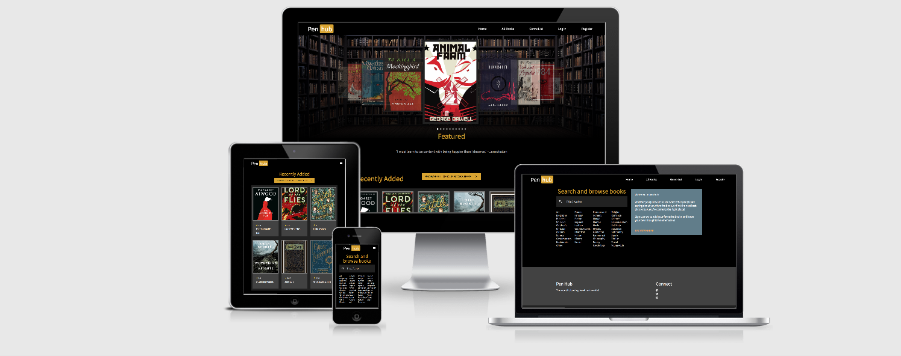

# Pen Hub

## Milestone Project 3 - Data Centric Development

For this project I have decided to build a book review and recommendation site.

The site will alow users to add, edit or delete details of a particular book and their review of it.
The user will also be able to search for books based on a rating system and to also purchase the book through
an affiliate link. The site owner will then be able to earn money based on each book purchased through the link.

***

## Contents

1. [UX](https://github.com/vdgvzr/milestone-project-3#ux)
    - [Goals](https://github.com/vdgvzr/milestone-project-3#goals)
    - [Developer Goals](https://github.com/vdgvzr/milestone-project-3#developer-goals)
    - [User Stories](https://github.com/vdgvzr/milestone-project-3#user-stories)
    - [Design](https://github.com/vdgvzr/milestone-project-3#design)
        - [Colours Used](https://github.com/vdgvzr/milestone-project-3#colours-used)
        - [Fonts](https://github.com/vdgvzr/milestone-project-3#fonts)
        - [Wireframes](https://github.com/vdgvzr/milestone-project-3#wireframes)
2. [Features](https://github.com/vdgvzr/milestone-project-3#features)
    - [Existing Features](https://github.com/vdgvzr/milestone-project-3#existing-features)
    - [Features Left to Implement](https://github.com/vdgvzr/milestone-project-3#features-left-to-implement)
3. [Testing](https://github.com/vdgvzr/milestone-project-3#testing)
4. [Deployment](https://github.com/vdgvzr/milestone-project-3#deployment)
    - [Deploying The Site](https://github.com/vdgvzr/milestone-project-3#deploying-the-site)
    - [Deploying Locally](https://github.com/vdgvzr/milestone-project-3#deploying-locally)
5. [Technologies Used](https://github.com/vdgvzr/milestone-project-3#technologies-used)
6. [Credits](https://github.com/vdgvzr/milestone-project-3#credits)
    - [Content](https://github.com/vdgvzr/milestone-project-3#content)
    - [Media](https://github.com/vdgvzr/milestone-project-3#media)
    - [Code](https://github.com/vdgvzr/milestone-project-3#code)
    - [Acknowledements](https://github.com/vdgvzr/milestone-project-3#acknowledgements)

***

## UX

### Goals

As part of the Full Stack Developer course from Code Institute, this project was designed to fulfill the scope of creating an application
that utilises CRUD operations on a database.

The primary demographic for the site will of course be book lovers, however there will likely be a very wide and diverse range
of people that would have interest in it. For this reason, I will aim to design the site to be as simple to use as possible,
leaving room for the appropriate information to be displayed as cleanly and easy to read as possible.

* Originally the idea was to create the book entry and review simultaneously, however I have decided to keep the book details
and review entries separate to mitigate duplication of book entries. Ideally the, review and rating for the book will appear beneath
the book details so two separate forms will have to be present on the site - one for book entry, and one for review entry for said book.

### Developer Goals

* Create an easy to use webapp where I can learn about and perform CRUD operations on a mongo database.
* Practice how to use Heroku, Mongo DB, Jinja, Materialize and Flask.

### User Stories

As a user, I would like to:

- [x] Search for and browse for my favourite book or something to read next.
- [x] Search for books based on genre.
- [x] See what other people are saying about books.
- [x] If the book doesn't exist on the site, I can add a book.
- [x] Be able to leave my own reviews on other books that other users have added.
- [x] Be able to buy a book via a link to an online shop.

***

### Design

I used the materialize framework to design the site. As much consideration as possible has gone into implementing components and altering the styles of each.
The books to be displayed to the user as easy-to-navigate interactive cards that contain essential information about the book, as well as a book rating on display.

#### Colours Used

I chose the colors based on the initial design of using yellow and black with grey to highlight the important sections, such as the book cards.
The primary color used is goldenrod, chosen because of it's lack of intensity compared to gold/yellow. Various shades of materialize grey is used for the standout sections.

Colours:

-  `#000000 - black, base colour`
-  `#DAA520 - goldenrod, primary colour`
-  `#A9A9A9 - darkgray, secondary colour`
-  `#808080 - gray, secondary colour`
-  `#D3D3D3 - lightgray, secondary colour`

Materialize Colors:

-  `#212121 - grey darken-4`
-  `#424242 - grey darken-3`
-  `#008000 - red (form valid)`
-  `#FF0000 - red (form invalid)`

#### Fonts

The font pair I chose for the site was Roboto and Noto Sans JP from [Google Fonts](https://fonts.google.com) because it closesly matches the smart-casual aesthetic of the site.

#### Wireframes

High quality mockups of the site can be found [here](static/assets/mockups/mockups.png "Mockups").

The implementation has stayed fairly consistent to the original design.

***

## Features

### Existing Features

#### Search Books by Title or Author

* The user can search by title or author to find books.

#### Registration and Login Functionality

* If a user wishes to add books and reviews themselves, then they can register and login to do so.

#### Add, Edit and Delete Book Entries and Reviews

* Once logged in, the user will be able to perform CRUD operations for books and reviews.

#### Buy Books

* Upon accessing the book review page, registered and unregistered users will be able to buy a book through a custom link.

### Features Left to Implement

* I would like the user profile to be expanded to include an option to upload a profile picture.
* I would also like to include a report or email feedback page, in case there are users leaving inappropriate reviews or book entries.

***

## Testing

### Homepage

### Responsiveness

### Test-Driven Development

### Testing Scenarios

1. 
    * 

### Other Bugs and Problems

*  A 5 star rating system was to be implemented for the user to rate a book. After trying to implement using css, it became known that it is very difficult to do with materialize as the form framework.
* There is a known bug with flask pagination, so the design of the search and all-books pages has been impacted as a result.

***

## Deployment

### Deploying The Site

To deploy the app on Heroku, the following steps have been followed:

1. Sign up to Heroku and create a new app.

2. Create a Procfile using the command: `echo web: python app.py > Procfile`.

3. Store the requirements in a text file: `pip3 freeze --local > requirements.txt`.

4. Add, commit and push all files to the GitHub repository.

5. In Heroku, connect to Github.

6. Select the repo and link to the Heroku collection.

7. Set the app's config variables within the settings page:

    - IP: 0.0.0.0
    - PORT: 5000
    - MONGO_DBNAME: <database_name>
    - MONGO_URI: `mongodb+srv://<username>:<password>@<cluster_name>-qtxun.mongodb.net/<database_name>?retryWrites=true&w=majority;`
    - SECRET_KEY: <secret_key>

8. Deploy the app on Heroku.

9. The app can now be opened and viewed.

### Deploying Locally

1. The following components are present:

    - [Git](https://gist.github.com/derhuerst/1b15ff4652a867391f03)
    - [pip](https://pip.pypa.io/en/stable/installing/)
    - [Python3](https://www.python.org/downloads/)
    - [A MongoDB Account](https://www.mongodb.com/cloud/atlas)

2. Download the .zip file from the repo in GitHub. You can also clone the repo using the following command:

    - `git clone https://github.com/vdgvzr/milestone-project-3`

3. Create an environment (env) whih must contain the MONGO_URI and SECRET_KEY variables.

4. Install all requirements from the requirements.txt file:

    - `pip3 install -r requirements.txt`

5. Create a Procfile and set the web scale:

    - `ech web: python app.py > Procfile`
    - `heroku ps:scale web=1`

6. Sign into MongoDB and create a new database with the collections:

    - books
    - genre
    - review
    - users

7. Run the python file. The app is now live.

***

## Technologies Used

* [Github](https://www.github.com/) - Used for hosting and version control.
* [GitPod](https://www.gitpod.io/) - Online code editor.
* [Flask](https://flask.palletsprojects.com/en/1.1.x/) - Flask site framework.
* [Jinja2](https://jinja.palletsprojects.com/en/2.10.x/) - For data templates.
* [Heroku](https://www.heroku.com/) - Used for app deployment.
* [MongoDB](https://www.github.com/) - Databse provider.
* [HTML5](https://en.wikipedia.org/wiki/HTML5) - For programming the templates.
* [CSS](https://en.wikipedia.org/wiki/Cascading_Style_Sheets) - For adding styles to html elements.
* [Javascript](https://en.wikipedia.org/wiki/JavaScript) - Used to write functions for site interactivity.
* [Python](https://www.python.org/download/releases/3.0/) - Used for writing app functions and to communicate with mongoDB using pymongo.
* [JQuery](https://jquery.com/) - Ussed to access elements between languages.
* [Materialize](https://www.materializecss.com/) - Design framework used for site components.
* [Balsamiq](https://www.balsamiq.com/) - Used for wireframe design.
* [HTMLValidator](https://validator.w3.org/) - For testing html code validity.
* [CSSValidator](https://jigsaw.w3.org/css-validator/) - For testing css code validity.
* [JavaScriptValidator](https://esprima.org/demo/validate.html) - For testing js code.
* [PythonCodeChecker](https://extendsclass.com/python-tester.html) - For testing python code.
* [Favicon](https://www.favicon-generator.org/) - For creating site favicon.
* [GoogleFonts](https://fonts.google.com/) - For providing fonts for the site.
* [AmIResponsive?](http://ami.responsivedesign.is/) - To test site responsiveness.

***

***

## Credits

### Media:

### Acknowledgements

* https://webdevtrick.com/css-star-rating/ for star rating concept.